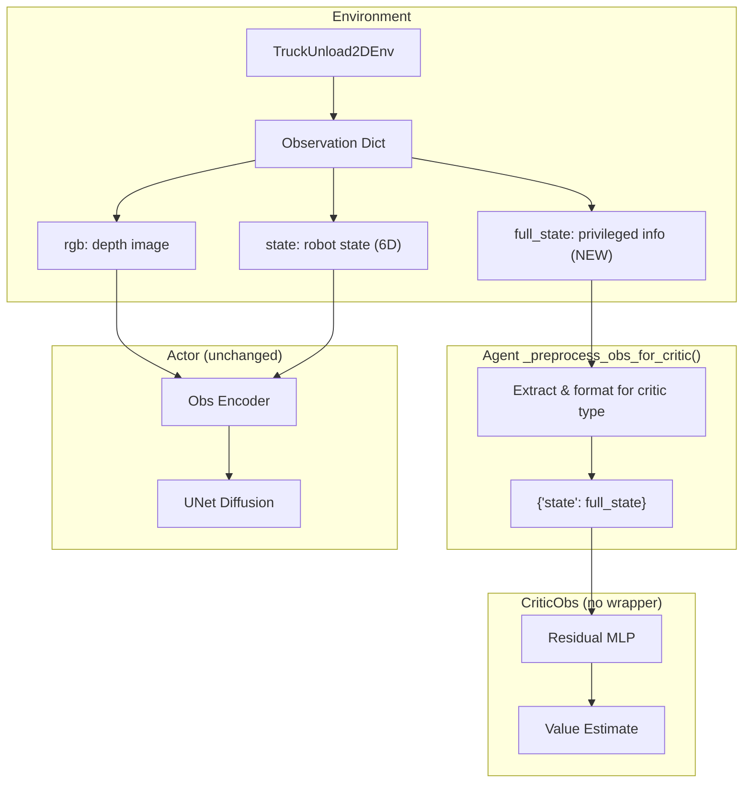

# Asymmetric Actor-Critic with MLP State-Based Critic

**Status: IMPLEMENTED AND TESTED**

## Overview

Add support for an asymmetric actor-critic setup where:

- **Actor**: Diffusion policy taking image + state history (unchanged)
- **Critic**: MLP-based `CriticObs` taking full privileged state (box poses, velocities, geometries)

## Architecture



The key insight: `CriticObs.forward()` already accepts `dict` with `"state"` key:
```python
def forward(self, cond: Union[dict, torch.Tensor]):
    if isinstance(cond, dict):
        state = cond["state"].view(B, -1)
    ...
```

So no wrapper is needed - the agent's `_preprocess_obs_for_critic()` just returns `{"state": full_state}`.

## Files to Modify

### 1. Environment: Add `full_state` to observations

**File**: `dppo_baseline/env/truck_2d_env.py`

Modify `_get_observation()` to return `full_state` containing:

- Entire station state (robot + box positions/velocities concatenated)
- Suction command and is_suctioned flags  
- Box geometries (width, height for each box in order)

**PlanarJoint**: 3 positions (x, y, θ) and 3 velocities (ẋ, ẏ, θ̇) per box.

**Full state structure**:
- `station_state`: [robot_pos (4), box_poses (max_boxes×3), robot_vel (4), box_vels (max_boxes×3)]
  - Length: 8 + max_boxes × 6
- Suction info: [last_suction_cmd, is_suctioned] (2)
- Box geometries: [w1, h1, w2, h2, ...] (max_boxes × 2)

**Total dimension**: (8 + max_boxes × 6) + 2 + (max_boxes × 2) = **10 + max_boxes × 8**

For max_boxes=4: 10 + 32 = **42D**

### 2. Model Factory: Support `mlp` critic type

**File**: `model/diffusion/mpi_ppo_diffusion.py`

Extend `from_mpi_checkpoints()` to handle `critic_type: mlp`:

```python
elif critic_type == 'mlp':
    # CriticObs works directly - no wrapper needed
    # Just move to device
    fresh_critic = fresh_critic.to(device)
    wrapped_critic = fresh_critic  # Direct use, no wrapper
```

### 3. Agent: Handle `full_state` for critic

**File**: `agent/finetune/train_ppo_diffusion_truck2d_agent.py`

Modify:

- Add `critic_type` config option (read from `cfg.model.critic_type`)
- Modify `obs_trajs` to store `full_state` key when present
- Modify `_preprocess_obs_for_critic()` to return `{"state": full_state}` for mlp critic type:

```python
def _preprocess_obs_for_critic(self, obs):
    if self.critic_type == 'mlp':
        # MLP critic uses full_state directly
        full_state = obs['full_state']
        if isinstance(full_state, torch.Tensor) and full_state.dim() == 3:
            # [B, T, D] - take latest step and flatten
            full_state = full_state[:, -1]
        return {'state': full_state}
    else:
        # Existing logic for mpi/vit critics
        ...
```

### 4. Test Config

**File**: `cfg/truck_2d/ft_ppo_mpi_truck_2d_mlp_critic_test.yaml` (new)

Create minimal test config:

- 2 training iterations, 10 n_steps, 2 environments
- `n_critic_warmup_itr: 0` (no warmup)
- `critic_type: mlp` with `CriticObs` configuration:

```yaml
critic_type: mlp
critic:
  _target_: model.common.critic.CriticObs
  mlp_dims: [256, 256, 256]
  activation_type: Mish
  residual_style: true
  cond_dim: 42  # full_state dimension
```

## Implementation Details

### Full State Structure

Simple concatenation approach - no manual index calculations:

```python
# In _get_observation():
# Station state is already: [robot_pos(4), box_poses(max_boxes*3), robot_vel(4), box_vels(max_boxes*3)]
station_state = self._station.GetOutputPort("state").Eval(station_context)

# Box geometries in same order as station state
box_geometries = np.array(
    [[box.w, box.h] for box in self._current_boxes], dtype=np.float32
).flatten()

# Simple concatenation - no parsing/reordering
full_state = np.concatenate([
    station_state.astype(np.float32),  # (8 + max_boxes*6,) - everything from Drake
    np.array([self._last_suction_cmd, is_suctioned], dtype=np.float32),  # (2,)
    box_geometries,  # (max_boxes*2,) - w,h per box
])
# Total: (8 + max_boxes*6) + 2 + (max_boxes*2) = 10 + max_boxes*8
```

**Note**: Assumes n_boxes == max_boxes (no padding needed).

### Backward Compatibility

- Environment always returns `full_state` in observations
- Existing critics (mpi, vit) ignore this key via `_preprocess_obs_for_critic()`
- New mlp critic uses it
- `shape_meta.obs.full_state.shape` specifies dimension in config

## Testing Plan

1. Create test config with minimal settings
2. Run training for 2 iterations to verify no crashes
3. Check that `full_state` is correctly populated
4. Verify critic receives correct input dimensions
5. Fix any bugs and re-run until clean

## Key Design Decisions

- **No wrapper for CriticObs**: Interface already matches - just pass `{"state": tensor}`
- **Extraction in agent**: `_preprocess_obs_for_critic()` handles all critic type differences
- **No exception handling**: Research codebase, fail fast
- **Minimal changes**: Existing code paths unchanged
- **Config-driven**: Critic type selected via yaml config