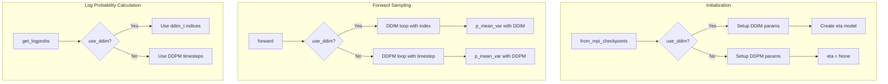

# DDIM Implementation for MPI PPO Diffusion

## Overview

Implement DDIM (Denoising Diffusion Implicit Models) sampling in [`mpi_ppo_diffusion.py`](dppo-baseline/model/diffusion/mpi_ppo_diffusion.py) to match the original DPPO implementation in [`diffusion_vpg.py`](dppo-baseline/model/diffusion/diffusion_vpg.py). The implementation will use the `use_ddim` flag to switch between DDPM and DDIM.

## Key Design Decisions

1. **Follow original DPPO pattern exactly** - Copy the DDIM logic from `diffusion.py` and `diffusion_vpg.py`
2. **Use `use_ddim` flag** - Same as original: `use_ddim=True` + `ddim_steps` controls DDIM
3. **Eta model integration** - Use the same `EtaFixed` class for DDIM variance control
4. **Fail loudly** - Use asserts instead of try/except for validation

## Architecture Flow



## Implementation Steps

### 1. Add DDIM Parameters to `from_mpi_checkpoints` and `__init__`

Add these new parameters matching [`ft_ppo_diffusion_unet_img.yaml`](dppo-baseline/cfg/robomimic/finetune/transport/ft_ppo_diffusion_unet_img.yaml):

```python
# In from_mpi_checkpoints:
use_ddim: bool = False,
ddim_steps: int = None,
ddim_discretize: str = "uniform",
eta: dict = None,      # Hydra config for eta model
learn_eta: bool = False,
```

### 2. Setup DDIM Schedule in `__init__`

Add `_setup_ddim_params()` method following [`diffusion.py` lines 155-196](dppo-baseline/model/diffusion/diffusion.py):

- Create `ddim_t` - timestep indices
- Create `ddim_alphas`, `ddim_alphas_prev`, `ddim_sqrt_one_minus_alphas`
- Flip all arrays for reverse diffusion order
- Add assertion: `ft_denoising_steps <= ddim_steps if use_ddim`

### 3. Modify `p_mean_var` for DDIM Support

Update to match [`diffusion_vpg.py` lines 139-224](dppo-baseline/model/diffusion/diffusion_vpg.py):

Key changes:

- Add `index` parameter for DDIM
- Change `ft_indices` logic based on `use_ddim`:
  - DDIM: `index >= (ddim_steps - ft_denoising_steps)`
  - DDPM: `t < ft_denoising_steps`
- Add DDIM x_0 reconstruction formula
- Add DDIM mu/sigma computation using eta model
- Return `(mu, logvar, eta)` tuple

### 4. Modify `forward` for DDIM Sampling

Update to match [`diffusion_vpg.py` lines 227-315](dppo-baseline/model/diffusion/diffusion_vpg.py):

Key changes:

- Use `ddim_t` for timestep loop when `use_ddim=True`
- Pass `index` to `p_mean_var`
- Update chain collection logic for DDIM
- Handle `deterministic` mode (eta=0 for DDIM)

### 5. Modify `get_logprobs` for DDIM

Update to match [`diffusion_vpg.py` lines 319-396](dppo-baseline/model/diffusion/diffusion_vpg.py):

Key changes:

- Use `ddim_t[-ft_denoising_steps:] `for timesteps when `use_ddim`
- Create `indices_single` for DDIM index tracking
- Pass indices to `p_mean_var`

### 6. Modify `get_logprobs_subsample` for DDIM

Update to match [`diffusion_vpg.py` lines 398-461](dppo-baseline/model/diffusion/diffusion_vpg.py):

Key changes:

- Use `ddim_t` instead of linear timesteps when `use_ddim`
- Create `ddim_indices` from `ddim_indices_single`
- Pass indices to `p_mean_var`

### 7. Update Config for Testing

Modify [`ft_ppo_mpi_truck_2d_reach_test.yaml`](dppo-baseline/cfg/truck_2d/ft_ppo_mpi_truck_2d_reach_test.yaml):

```yaml
# Add DDIM config options
use_ddim: true  # Toggle for test
ddim_steps: 5   # Or same as ft_denoising_steps

model:
  use_ddim: ${use_ddim}
  ddim_steps: ${ddim_steps}  # Usually equals ft_denoising_steps for full FT
  learn_eta: false
  eta:
    _target_: model.diffusion.eta.EtaFixed
    base_eta: 1
    input_dim: ${obs_dim}
    mlp_dims: [256, 256]
    action_dim: ${action_dim}
    min_eta: 0.1
    max_eta: 1.0
```

## Files to Modify

| File | Changes |

|------|---------|

| `mpi_ppo_diffusion.py` | Add DDIM parameters, schedule setup, modify p_mean_var, forward, get_logprobs |

| `ft_ppo_mpi_truck_2d_reach_test.yaml` | Add use_ddim, ddim_steps, eta config |

## Validation Checklist

- [ ] `use_ddim=False` produces identical behavior to current implementation
- [ ] `use_ddim=True` matches original DPPO DDIM behavior
- [ ] Chain shapes correct for both DDPM and DDIM
- [ ] Log probabilities computed correctly for both
- [ ] Asserts validate: `ft_denoising_steps <= ddim_steps` when using DDIM
- [ ] Integration test passes with reach task config